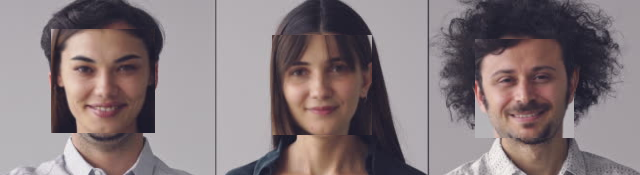
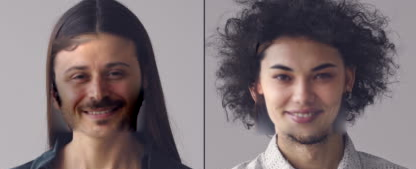
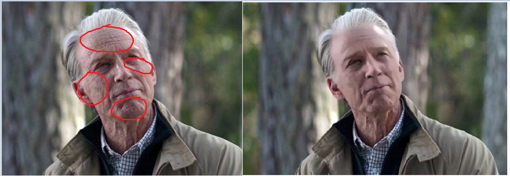
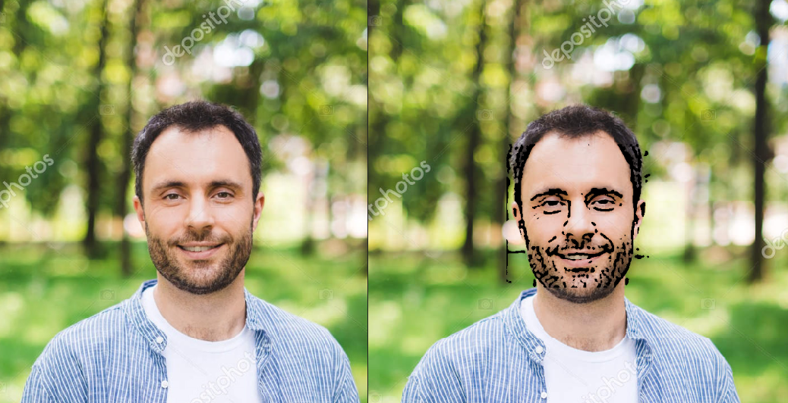
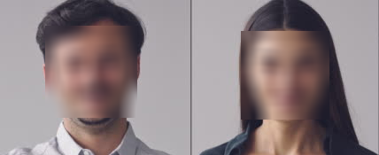
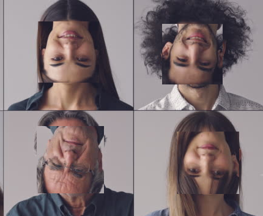
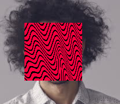
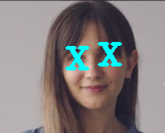
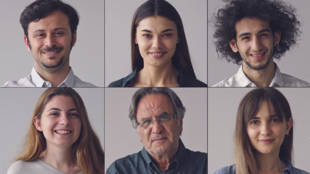

# Face Replacer 👦 👉 👱‍♂️‍

## How to use
```$. python main.py <Image path> -m <mode> -t <type>```
- modes
    - replace ```-m replace```
      - **types** > noBox (```-o``` for outline the area (**__optional argument__**))
    - effects ```-m effects```
      - **types** >```-t``` beauty, flip, cartoon, pewdiepie, xi, blur.
  
- ### Samples
  - face swap (_randomly_)```(<path> -m replace)```<br>
    
    <br>
  - face swap **noBox** ```(<path> -m replace -t noBox)```<br>
    
    <br>
  - Anti ageing / Beauty  ```(<path> -m effects -t beauty)```<br>
    
    <br>
  - Cartoon  ```(<path> -m effects -t cartoon)```<br>
    
    <br>
  - Blur  ```(<path> -m effects -t blur)```<br>
    
    <br>
  - Flip  ```(<path> -m effects -t flip)```<br>
     
    <br>
  - Pewdiepie  ```(<path> -m effects -t pewdiepie)```<br>
     
    <br>
  - X Eye  ```(<path> -m effects -t xi)```<br>
     
    <br>
  - ### Original
    
    <br>
 